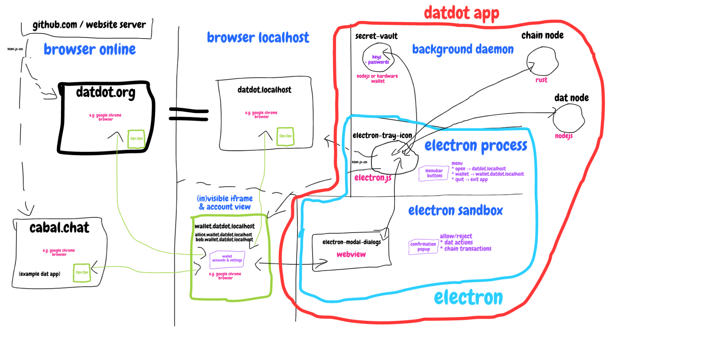

# DATDOT NODE SPEC

* **=> [previous spec](../v0.0.9-datdotArchitectureMerger~2021.10.15_2021.11.03/)**
* **=> [next spec](../v0.1.1-datdot_merged_architecture~2022.01.18/)**

## `@todo`
* [x] include details from previous spec (v0.0.9) in this version

## Pitch: filecoin for dat/hypercore
bridge (between Dat Protocol and Substrate)
* but also includes a new runtime module
* The result will be able to run as a parachain or parathread
* would enable access to large file storage to substrate

### 1. Problem:
**Dynamic datasets** with immutable history - it's hard to have guarantees about their availability.
If we want to keep data available and up to date -> we have to keep our computer running or we have to rent a server.

### 2. Challenges:
What if you want other people to help you seed your data?
- what incentives do they have?
- how to find them and to trust them?
- how to verify they are seed our data?

### 3. Solution:
A decentralized bridge between Dat Protocol and Substrate with a built-in incentive model which manages relationships between:
- dat creators
- dat pinners (who keep data available/host the data)


## ARCHITECTURE
1. [chain (substrate node)](./chain/README.md)
2. [service (javascript hyper based)](./service/README.md)
3. [vault](./vault/README.md)
4. [wallet](./wallet/README.md)
5. [ui](./ui/README.md)

browser online => most insecure (= things can change while you visit the page)
browser localhost => more secure (= things won't change while you visit if you don't confirm)
datdot app: electron webapp => still secure (= but custom browser we maintain - so careful)
datdot app: electron process => full power while running (=we have to be most careful, it has access to the users system)
datdot app: daemons => full power all the time (these are already defined in scope and mostly implemented)

```js
const chain = require('datdot-chain')
const service = require('datdot-service')

// @TODO: refine this

chain(service(chain))
```



