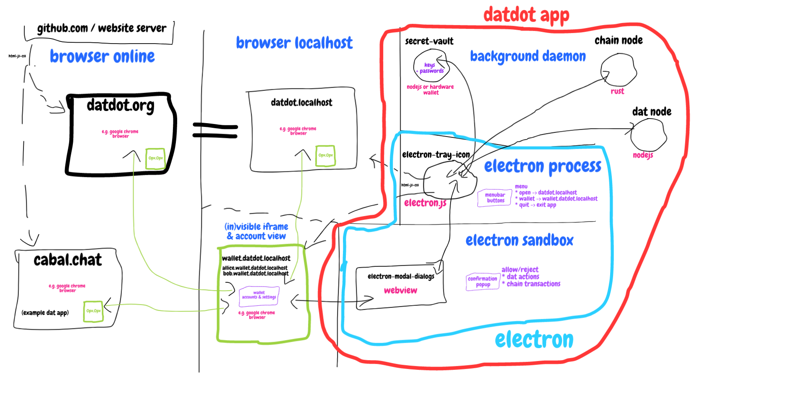

# DATDOT NODE SPEC

**=> [previous spec](../v0.1.0-datdot_architecture@2021.12.02_2021.12.31/README.md)**

# @TODO:

## `@todo`
* [ ] markdown file to document all
  * the public substrate methods
    * update API in mermaid sequence diagram
  * the arguments and types needed
  * the events emitted by substrate to listen to
    * update events in mermaid sequence diagram
* [ ] list of custom types we use for JS
  * => try to set up rustdocs and stabilized api
  * => do some tests in Rust
  * => put together proper integration tests in JS
* [ ] check `2_publisher.md` might need upgrade to:
  * `offer` - `supply` style API
  * to properly register a new hypercore
  *
## `@todo`
* [ ] change or add
  * not deal with hypercores but with individual chunks
  * SIGNER => ENCODER
  * PINNER => HOSTER or SEEDER
  * randomly select X * R(edundancy) pinners
  * make direct connection between
  * many ENCODER and one PINNER
  * to send differently encoded chunks for same hypercore

## `@todo` - Strategy for writing SPECIFICATION
> 1. start with DATA OVER THE WIRE => WORK BACKWARDS
> 2. derive this from ROLES in the SLIDES
3. make modules to be re-usabe in
  * cli
  * electron
  * browser
4. try to use "standard hyper components"
6. work without necessity of merge/rebase/pullrequests
  * => but rather independent modules
  * => make that into an app for all playproject contractors to work with
    * => instead of explaining people how to work together!
    * => make onboarding easy ... think about DATDOT-DEV (onchain) process
7. SUBSTACK: => waiting for modular architecture
  * but i think next we need some idea of what messages each component
  * will need and then we can start building out the components
8. SPEC QUESTIONS
  * What else is not defined in detail?
  * Where should we keep the list of all these 'todos'? Issues?


## Pitch: filecoin for dat/hypercore
bridge (between Dat Protocol and Substrate)
* but also includes a new runtime module
* The result will be able to run as a parachain or parathread
* would enable access to large file storage to substrate

### 1. Problem:
**Dynamic datasets** with immutable history - it's hard to have guarantees about their availability.
If we want to keep data available and up to date -> we have to keep our computer running or we have to rent a server.

### 2. Challenges:
What if you want other people to help you seed your data?
- what incentives do they have?
- how to find them and to trust them?
- how to verify they are seed our data?

### 3. Solution:
A decentralized bridge between Dat Protocol and Substrate with a built-in incentive model which manages relationships between:
- dat creators
- dat pinners (who keep data available/host the data)


## ARCHITECTURE
1. [chain (substrate node)](./chain/README.md)
2. [service (javascript hyper based)](./service/README.md)
3. [vault](./vault/README.md)
4. [wallet](./wallet/README.md)
5. [ui](./ui/README.md)

browser online => most insecure (= things can change while you visit the page)
browser localhost => more secure (= things won't change while you visit if you don't confirm)
datdot app: electron webapp => still secure (= but custom browser we maintain - so careful)
datdot app: electron process => full power while running (=we have to be most careful, it has access to the users system)
datdot app: daemons => full power all the time (these are already defined in scope and mostly implemented)

```js
const chain = require('datdot-chain')
const service = require('datdot-service')

// @TODO: refine this

chain(service(chain))
```



