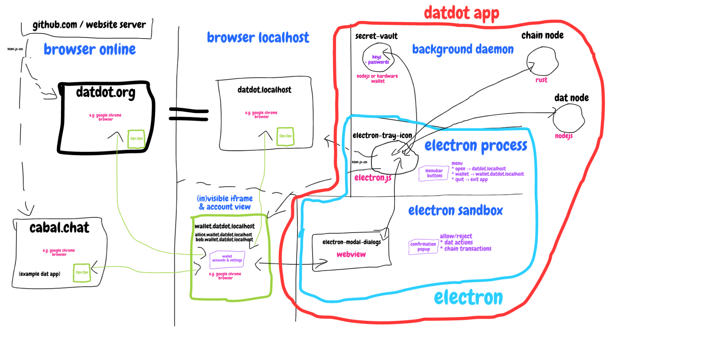

# DATDOT NODE SPEC

* **=> [previous spec](../v0.1.1-datdot_merged_architecture~2022.01.18/)**
* **=> [next spec](#../v0.1.3-datdot_consolidated_architecture~2022.02.09_2022.09.11)**

## `@todo`
* [x] include details from previous spec (v0.1.1) in this version
* [x] move remaining todos to next spec version


```js
/*
// @TODO:
=> check what is VAULT.md
=> while solving WALLET.md#CREATE (A/B/C/D)
   => to figure out how to connect to VAULTS


@@@@@@@@@@@@@@@@@@@@@@@@

// @TODO: merge/mark architecture process
// ----------------------------
ENVIRONMENTS:
// ----------------------------
1. NATIVE OPERATING SYSTEM
  * CUSTOM OS
  * CUSTOM HYPER OS
  * CUSTOM DATDOT HYPER OS
2. SHIMMED DESKTOP SYSTEM
3. SAME DEVICE EXTERNAL CLIENT (e.g APP TAB)
4. EXTERNAL DEVICE CLIENT
5. (EXTERNAL?) TERMINAL


// @TODO: merge/mark architecture process
// ----------------------------
SITUATION/SCENARIOS:
// ----------------------------
1. running system
2. just vault
3. with hardware wallet
4. remote device app
5. system vault + remote wallet
6. app inside datdot.org
7. app in different browser tab
8. app on datdotOS desktop
9. app on phone browser


// ----------------------------
ARCHITECTURE PROCESS
// ----------------------------
1. HARDWARE
  * user triggers install
  * user provides config input
2. KERNEL SHIMS
  * web view + web server
3. WEB KERNEL
4. SYSTEM INIT_STARTUP (index.html+index.js)
  * user provides config input (provision?)
5. SYSTEM_init_process+restart
6. LOGIN_SCREEN_init
7. LOGIN_SCREEN_restartup
8. APP_init
  * app pairing
  * app paired
9. APP_restore/restart

// ----------------------------
USER SECURITY
// ----------------------------
1. VAULT SETUP/START
2. WALLET SETUP/STARTUP
3. VAULT/WALLET/KERNEL Pairing


// ----------------------------
SETUP/STARTUP PROTOCOLS
DATA VAULT WALLET FEED SYSTEM
WEBKERNEL+SYSTEM (STARTUP) CODE

*/

## ARCHITECTURE 1
1. [chain (substrate node)](./datdot-chain-node/README.md)
  * => `datdot-node`
  * => `datdot-chain`
  * => `datdot-runtime`
    * [API](https://github.com/playproject-io/datdot-substrate/blob/master/bin/node/runtime/src/dat_verify.rs)
  * `/datdot-pallet-verify`
  * `datdot-pallet-balance`
2. [service (javascript hyper based)](./datdot-service/README.md)
  * [API](https://github.com/playproject-io/datdot-service/blob/master/index.js)
3. [vault](./datdot-vault/README.md)
4. [wallet](./datdot-wallet/README.md)
5. [ui-webapp](./datdot-ui-webapp/README.md)
---
6. [ui-org](./datdot-ui-org/README.md)
7. [webkernel-server](./datdot-webkernel-server/README.md)
8. [shim](./datdot-shim/README.md)
  * electron
9. [gateway](./datdot-gateway/README.md)
  * daemon


```js
const chain = require('datdot-chain')
const service = require('datdot-service')

// @TODO: refine this

chain(service(chain))
```

@TODO:
* [ ] set architecture based on `CONCEPTS` folder evaluation

## ARCHITECTURE 2
see [here](https://gist.github.com/substack/e037d1d2015b7a3e0001fc4bdd463b9c)
```js
const architecture = `
  [7. substrate chain daemon]
              ↑
              │
              ↓
  ┌────> [5. chain api] <───> [other chain implementations*]
  │
  │      [4. seeding_service api] <───> [kappa/hyper-core]
  │           ↑
  │           │
  │           │
  ├───────────┼─> [3. cloud/localhost https/wss server] <─────┐
  │           │                                               ↓
  │           │                                 [6. web user interface]
  │           │                                           ↑   ↑
  │           │     [2. datdot electron app] <────────────┘   │
  │           │                                               │
  │           │     [web browser] <───────────────────────────┘
  │           │
  └───────────┴───> [1. datdot command-line interface]
`
```
browser online => most insecure (= things can change while you visit the page)
browser localhost => more secure (= things won't change while you visit if you don't confirm)
datdot app: electron webapp => still secure (= but custom browser we maintain - so careful)
datdot app: electron process => full power while running (=we have to be most careful, it has access to the users system)
datdot app: daemons => full power all the time (these are already defined in scope and mostly implemented)





## CONCEPT
```
## ROLES - assignment of ROLES needs to have a PEERS SET to select from
NODES come and go, so having role assignment per SESSION (=time window) or a ROLLING algorithm is important

### SUBSTRATE NODE
1. CHAIN      - (=rules) (=for `Proof of Data Possession` **PoDP**) to verify storage

### DATDOT NODE
0. PEER    - (= `Account`, `Actor` or `Identity`)
1. HOSTER     - (=stores hypercores) is `PINNER`
2. PUBLISHER
3. BACKER     - (=is BACKING THE DATA) is `SUPPORTER`
4. SEEDER     - (=friends) is `PINNER` and `SUPPORTER`
5. ENCODER
6. ATTESTER   - (=for `Proof of Retrievability` **PoR**) to verify hosting
7. VALIDATOR  - (=chosen from to produce blocks) Authorities are the actors, keys or identities who, as a collective, manage consensus on the network. AuthorityId can be used to identify them
8. PRODUCER   - (= `Block Author` or `Block Producer`)

### DAT PEER
1. AUTHOR (=owner/creater of hypercores)
2. READER
3. SWARMER

## SUMMARY
1. `publisher` selects `dat address` they want to see `hosted`
2. `seeders` (friends or folks interested in the data) volunteer to provide disk space to store and seed the data for free
3. `hosters` want public recognition and provide disk space to store and seed the data to have it publicly accounted on chain
4. `backers` who accumulated ratio on chain and want to see `dat addresses` being `hosted` get prioritized
  * in case not enough `seeders` and `hosters` are available to `seed` all selected `dat addresses`

**the `keeping track` part works as follows:**

1. each time a hypercore is submitted for pinning, the network of all peers makes a collective coin flip to chose a random "peer" of those who registered their willingness to offer hosting with their disk space for the role of "hoster"
2. another random peer is selected for the role of "encoder"
3. the encoder receives the hypercore that will be pinned and encodes it and submits the merkleroot to the chain and passes the encoded hypercore on to the hoster
4. the hoster stores it and makes it available to the regular dat network and also submits the merkleroot to the chain
5 the chain checks random hoster and random encoder submitted the same merkle root and starts the challenge phase it thats true.
4. in the challenge phase, the chain will continuously emit challenge events for a proof-of-supply or proof-of-service
5. it consists of the **proof-of-data-possession**, where the challenge event from the chain ask for a random chunk the hoster is storing and the hoster has to submit the encoded chunk with a merkle proof to the chain so the chain compares it to the merkle root it has
6. it consists of the **proof-of-retrievability**, where the challenge event selects X random peers as ATTESTERS to join the dat swarm of that same hosters hypercore and ask for a bunch of chunks and report back to the chain if they received those
7. if both, the proof-of-data-possession and the proof-of-retrievability succeed, the **proof-of-service** is successful and the ratio is noted on chain

--------------------------------------------------------------------------------------------
--------------------------------------------------------------------------------------------
--------------------------------------------------------------------------------------------


---
slideOptions:
  # spotlight:
    # enabled: true
  # allottedMinutes: 5
  transition: "slide" # options: none/fade/slide/convex/concave/zoom
  transitionSpeed: "fast" # options: [default/fast/slow
  # theme: "black" # black (default) - league - blood - night - moon - solarized - white - sky - beige - simple - serif
  # HELP: https://hackmd.io/slide-example#
---

# [datdot roadmap](https://hackmd.io/@serapath/Hy8W0srar#/)
1. [context](#/1)
2. [roles](#/2)
3. [mechanics](#/3)
4. [architecture](#/4)

---

# [context](#/0)
1. [idea](#/1/1)
2. [problem](#/1/2)
3. [solution](#/1/3)
4. [issues](#/1/4)
    * [`self service attack`](#/1/5)
    * [`sybil attack`](#/1/6)
    * [`outsourcing attack`](#/1/7)
5. [fixes](#/1/8)
    * [`self service attack`](#/1/9)
    * [`sybil & outsourcing attack`](#/1/10)

----

### [idea](#/1)
**make a free p2p alternative to [hashbase.io](https://hashbase.io)**
* everyone who downloads and runs **`datdot`** offers some free disk space which is used to permanently seed hypercores datdot users submit to the `datdot` network

----

### [problem](#/1)
all it takes is a single "malicious" user, who submits enormous amounts of and/or very large hypercores to the `datdot` network to be pinned, rendering the service useless for all other honest peers.

----

### [solution](#/1)
measure the ratio of disk space provided to dat dot over time.
If free disk space provided by all peers is not enough to seed all hypercores submitted bypeers, hypercores submitted or selected by peers with a higher ratios get prioritized.

----

### [issues](#/1)
malicious users can still cheat the `datdot` network
1. by applying a [`self service attack`](#/1/5)
2. by applying a [`sybil attack`](#/1/6)
3. by applying an [`outsourcing attack`](#/1/7)

----

### issue [`self service attack`](#/1)
a malicious datdot user could illegitimately increase his ratio, by submitting a lot of hypercores to the datdot network and offering to seed them - essentially not providing any service to others, but increasing his ratio in order to free ride and receive service by others later on.

----

### issue [`sybil attack`](#/1)
a malicious datdot user runs many datdot clients to offer disk space for seeding hypercores with the goal to seed their own hypercores or seed the same hypercores many times, but store them only once but respond to chunk requests with data from only a single hypercore copy, thus receiving an illegitimate positive ratio

----

### issue [`outsourcing attack`](#/1)
a malicious datdot user runs only a single datdot client to offer disk space for seeding hypercores with the goal to join the corresponding hypercore swarm and receive chunks quickly just in time to respond to chunk requests from hypercore swarm peers and not storing any hypercore chunks themselves, thus receiving an illegitimate positive ratio

----

### [fixes](#/1)
malicious users can still cheat the `datdot` network
1. by fixing the [`self service attack`](#/1/9)
2. by fixing the [`sybil and outsourcing attack`](#/1/10)

----

### fix [`self service attack`](#/1)
Assign hypercores submitted to `datdot` for seeding to random seeder peers, so peers who want to seed cannot cherry pick the chunks they want to seed.
In order to prevent malicious user to accumulate node pairs they control where the randomly picked seeder happened to be under their control too, re-enabeling the self-service attack, we frequently enough re-shuffle which nodes seed which data.

----

### fix [`sybil & outsourcing attack`](#/1)
every copy of every chunk of every hypercore seeded by the `datdot` network should be encrypted with a private key unavailable to the seeder, so they can't use the `sybil` or `outsourcing` attack, thus replacing each chunk with **a recoverable signature containing the entire chunk** and merkelizing it. The random encryption is renewed frequently enough to prevent attackers from accumulating nodes where they by chance where chosen to provide the encryption key.

---

# [roles](#/0)
* **[ROLE: peer](#/2/1)**
* [ROLE: seeder](#/2/2)
* [ROLE: signer](#/2/3)
* [ROLE: author & supporter](#/2/4)
* [ROLE: attestors](#/2/5)
* *[ROLE: reader](#/2/6)*

----

### **[ROLE: peer](#/2)**
* anyone who downloads and runs a `datdot` client
* can take on as many other available roles in parallel as they want
* minimum and default ratio is 0 and can never drop below that

----

### [ROLE: seeder](#/2)
* opt-in to offer disk space to store submitted/selected hypercores
* receive random hypercore address chunks to seed
* get assigned an increased RATIO
    * every time a `proof of chunk(s)` challenge succeeded

----

### [ROLE: signer](#/2)
* `signer` peers get randomly selected by the network
* receive random hypercore chunks to encrypt with their private keys
* send encrypted chunks to randomly selected seeders
* get assigned an increased RATIO
    * every time they encrypt hypercore chunks

----

### [ROLE: author & supporter](#/2)
* peers who (submit and/or select) hypercores to be seeded by random seeders
* get assigned a decreasing storage ratio while submitted/selected hypercores are seeded by seeders
    * every time a `proof of chunk(s)` challenge succeeded
    * the more peers select a submitted hypercore, the less their storage ratio is decreased while the hypercore is begin seeded

----

### [ROLE: attestors](#/2)
* `attestor` peers get randomly selected by the network reoccuringly
* network randomly assigns them to [challenge](#/3/1) random seeders
* get assigned an increased RATIO
    * every time a `proof of chunk(s)` challenge succeeded

----

### *[ROLE: reader](#/2)*
* download hypercore chunks

---

# [mechanics](#/0)
* [proof of seeding](#/3/1)
* [ratio](#/3/2)
* [mechanism](#/3/3)

----

### [proof of seeding](#/3)
[Network IO is orders of magnitudes slower than asymmetric decryption of hypercore chunks](https://gitter.im/datproject/discussions?at=5da8793c57c2517c6a253554)
1. [`attestors`](#/2/5) request random chunks from assigned seeder
2. signs and publishes results of merkle proof to network
3. joins swarm for unencrypted version of seeded hypercore
4. requests random set of chunks from seeder
5. publish latency/throughput results to network

----

### [ratio](#/3)
* is a non-negative property of every peer
* can be transfered to selected peers
* is decreased if a peer uses datdot to seed hypercores
* is increased if a peer serves disk space to datdot by seeding hypercores

----

### [mechanism (="voting model)](#/3)

<!-- economics/pricing -->
1. how much do i want to earn in terms of "ratio"?
    * for my disk space?
    * for encrypting hypercore chunks?
    * for validating chunks?
    * for receiving data?
3. how much do i offer to pay in terms of "ratio"?
    * for having my hypercores pinned?

### traffic
* traffic is free

ratio derives from measurable aspects, e.g.
  - we might incentivize ratio gain in underrepresented regional areas

**traffic ratio**
1. nobody needs to pay for traffic, but every node stores few chunks of all and netowkr rebalances so the load on each node is aprox. equal or changes on re-shuffles
2. increase ratio based on average throughput, so seeders in times of many downloads gain more ratio which also incentivizes more seeders and disincentivizes leeching attacks

============

Storing asymmetric encrypted data is ~50% larger
* https://crypto.stackexchange.com/questions/5782/why-is-asymmetric-cryptography-bad-for-huge-data
*

============


EVENTS:
1. new hypercore addresses in datdot network
2. changes in seeding of specific hypercore adress (more less duplication)
3. updates in chunks of specific hypercore adress

API:
1. query for any or all hypercores addresses and seeding and other related data about them

FUTURE FEATURES:
1. regional markets & latency optimization
2. deduplication of chunks


============


So if i try to summarize:

1. a malicious attacker can run lots of modified datdot nodes to censor the network and in case of "critical mass" render not the friend mechanism but the public network mechanism unuseable - but in that case they can also "print" themselves ratio ...it's the worst case scenario, but it costs a lot of resources too
2. rewarding block producers with ratio will not prevent (1.)
3. block production is free of costs
4. epoch length and rule to join "validator set" is necessary and probably choosing a good rule can make the network marginally more reliable, but i even wonder if that is important - skipping blocks from time to time is probably not even really noticeable, but ok :-) ...lets try to make things nice
5. other than the attack (1.), an attacker can't benefit from opting out of block production or producing invalid blocks - and often a "fallback" might even prevent the skipped block - and even if a block is skipped, then it just takes 6 more seconds to include extrinsics in the next block. ...so a minor delay
finality helps us to keep the chain short, because we can discard data, right?

default epoch: 600 slots
default mechanism for finality: GRANDPA (goal: balance between chain storage vs. finality syncing costs)
default block production mechanism: BABE (select random block producers + 1+ fallbacks from validator set)
validator set: optimize for reliability

============

https://github.com/playproject-io/datdot-substrate/issues/12#issuecomment-569041754

============

so we might wanna add that too and balance between:
1. chain length (needed data storage)
2. cost of syncing with all attestors to reach finality

...is there already a good default or an optimum that adapts to the amount of attestors?
and whats the default mechanism to add somebody to the validator set? ...like for people who kind of don't care, because in my current opinion, block producers dont have costs and cant abuse the mechanism to gain in any way directly from that act and even indirect gains are extremely difficult or maybe impossible to achieve. ...so why not:
1. chose something as liberal as possible
2. to optimize for "reliability"
3. and not reward block producers for producing blocks
4. and not require any staking or punishment either

...and lets see if that works :-)

yes - and the dynamic set would probably have the goal to have the system as "stable/reliable" as possible in absence of any other goals i guess... but if there is no research yet, then we can just go with an easy mechanism, like adding any peer as soon as they come online and removing them once they go offline ...and if we figure out adding/removing creates overhead, maybe we can slightly optimize our simple best guess

============


**MOVES:**
- region markets or region optimization or friend ratios

when you submit a hypercore you also set the price you're willing to pay
for the service regarding your ratio, unless we find a way to calculate that price automatically

**DIMENSIONS:**
1. Disk Space
2. Latency (multifacetted, regional)
3. Upload (throughput/traffic)
4. Download (throughput/traffic)
5. Chunk Encryption
6. Validation
7. decryption

**MODEL:**
1. all peers have 0 or more ratio
2. all hypercores get seeded forever if possible
3. if seeders can not provide enough disk space to seed hypercores
    * existing hypercores submitted/selected by peers with lower ratio get prioritized when dropping duplicates or making them entirely unavailable
    * prioritizing = the random selection of a peer gets weighted so the likelihood of selecting a particular peer is higher
4. peers with a worse ratio getting worse guarantees for having their hypercores seeded by the network

### EXAMPLE `PEER`
1. **A**
```javascript
const peer = {
  name: 'A',
  ratio: {
    datdot1: {
    /*disk storage*/mb: [20, 10],
    /*traffic troughput*/net: { /*upload*/ul: [5, 3], /*download*/dl: [6, 2] },
    /*(de/en)cryption*/ crypt: [50, 30],
    /*validation*/ crypt: { en: [], de: [] },
    }
  }
}
```

1. how much disk space is required by all hypercores?
2. how much upload is required by all readers?
3. how much download is required by all seeders?
4. how much compute is required for encryption/decryption vs. friends?
5. how much upload/download is required by attestors?
6. what about regional constraints?

===========
PRICING:

- bandwidth
- tcp transport layer throttles speed to match bottleneck
- overflow dropped packages indicate and trigger the slowing down
- algos: "slow start", "fast retransmit"
-
encryption: CPU+RAM

https://www.sciencedirect.com/science/article/pii/S2352864818302001
* decrytion: 80-160ms per KB
* encryption: 140-230ms per KB
* => 2.50 GHz Intel Core i5 Processor and 8 GB RAM
* 8KB: 700-725ms
*

## AVERAGE (AWS/AZURE/GOOGLE)

#### 1. [FUNCTION INVOCATION][1]
* AWS   : $0.000000200 / invocation
* AZURE : $0.000000200 / invocation
* GOOGLE: $0.000000400 / invocation
* **AVERAGE:** $0.000000266 / invocation

#### 2. EXECUTION TIME: RAM (GB-s) (=memory) + CPU (GHz-s) (=compute)
* [AWS   : $0.00001667 execute/s][2]
* [AZURE : $0.00001600 execute/s][3]
* [GOOGLE:][4]
    * GB-seconds price: $0.0000025 MEMORY
    * GHz-second price: $0.0000100 CPU
* **AVERAGE:** $0.00001500 execute/s

#### 3. [BANDWIDTH:][5]
* AWS   : $0.09/GB (inbound egress) + free (outbound ingress)
* AZURE : $0.09/GB (inbound egress) + free (outbound ingress)
* GOOGLE: $0.12/GB (inbound egress) + free (outbound ingress)
* **AVERAGE:** $0.10/GB (inbound egress) + free (outbound ingress)

#### 4. [STORAGE][6]
* [AWS   : $0.0230 per 1 GB/months][7]
* [AZURE : $0.0184 per 1 GB/months][8]
* [GOOGLE: $0.0260 per 1 GB/months][9]
* **AVERAGE:** $0.0224 per 1 GB/months

[1]: https://dashbird.io/blog/ultimate-serverless-benchmark-2019/
[2]: https://aws.amazon.com/lambda/pricing/
[3]: https://azure.microsoft.com/en-us/pricing/details/functions/
[4]: https://lumigo.io/aws-lambda-cost-guide/
[5]: https://www.nefiber.com/blog/cloud-egress-charges/
[6]: https://cloud.google.com/compute/disks-image-pricing
[7]: https://aws.amazon.com/s3/pricing/
[8]: https://azure.microsoft.com/en-us/pricing/details/storage/blobs/
[9]: https://cloud.google.com/storage/pricing


**`TOTAL COSTS`** = `INVOCATION` + `EXECUTION TIME` + `BANDWIDTH` + `STORAGE`


...
for each chunk select random signer

overhead of connecting and finding a signers
should not be unreasonable large
compared to signing chunks.

maybe its more efficient to have signers always
sign a bunch of chunks and not just a single one

randomly select X*r pinners (r = redundancy factor)

* what is the best way for the pinner to receive signed chunks

=> many pinners (seeder) will receive chunks for the same hypercore,
but signed with different keys

* how did ratio work in torrents?

...

==========================================

1. so, when a seeder is selected at random, we tell them which compression parameters
to use for compressing chunks and those params are always unique per seeded copy.

2. the seeder needs to submit

------------------

verifiable time-delay function
=> one where verification happens with fast decoding


invertable verifiable delay functions


----------


PROOF of REPLICATION
= PROOF of SPACE (or STORAGE)
  + PROOF OF RETRIEVABILITY

PROOFER = SEEDER
=> runs encoding on piece of data

encoding is slow,
so its possible to detect if they generate data


proof of space achievable via:
=> inefficient unsealing
=> inefficient data extraction

=> fast unsealing (with e.g. zig zag)
==> fast data extraction


======================================================================================
======================================================================================

##############
DECEMBER 12th

rename: `adapter.js` to `service.js`


##################
DECEMBER 26th

GITHUB ISSUE DISCUSSION of JOSHUA

SUMMARY
tl;dr the goal of datdot is to create a decentralized pinning service for [dat](https://datprotocol.com/),
akin to [hashbase](https://hashbase.io/) (which is hosted centrally by a single person), but with backend logic and reliability checking handled by substrate.

This repo will (eventually) just hold a pallet or set of pallets that will let runtime devs integrate dat and dat pinning in their runtime (think "run your own filecoin") and a runtime and node implementation using the pallets.


QUESTION:
Where can we learn more about:
1. Timeline:
    * when is an early version of this meant to be ready?
2. Incentives:
    * What is paid for? only storage? only bandwidth? both?
    * Who pays for what? down
    * What scheme is used for ensuring honest service?
    * How is quality of service regulated, such as up/down speed, latency, etc.
3. How is this model compared to existing decentralised storage network services? such as
    * Storj
    * Airweave
    * Sia
    * Filecoin

ANSWER:

will ping here when we have this stuff written down in a more coherent format, but currently the details are spread across a series of hackmds and recorded videocalls which aren't publicly available atm.

I'm going to dump an outline here though:

1) We plan to have an early prototype early-to-mid January.
2) You get paid for successful challenge-responses, where challenges are of random duration (to prevent seeders going online exclusively to respond to challenges), of a random chunk of a dat archive (to prevent only storing data of chunks that you know will be challenged).

Challenges are made for the content of a "parallel" archive (merkle tree where the chunks of the archive are signed versions of the chunks of the actual dat archive), and augmented by attestations of service quality made by randomly selected offchain peers (to ensure that seeders are actually participating in the Dat network, not just the challenge-response game) - these attestations contain optional latency and location data (up to the attester) and we plan to display this information in our UI so that users have a better idea of QoS they are receiving.

We also intend to allow users to designate "non-voting" attestors so they can fine-tune what information the chain collects for them - these attestors will be directly rewarded by the user requesting their attestation and not by minting new tokens.

Incentives are provided by minting tokens on successful challenge-response, and optionally users burning tokens per challenge in order to prioritize their archives being assigned to seeders. It is more akin to a ratio (think bittorrent seed/leech ratios) than a mined/staked cryptocurrency.

3) The largest difference with most existing solutions in the space is that we don't intend to build a monolithic chain, but rather provide this as a tool for individual communities and substrate chains to build their own "storage communities". We also inherit the properties of the Dat protocol (high performance *dynamic* datasets, in contrast to static content on ipfs if you don't use ipns, which is unreliable due to it relying on changes to propagate over a DHT). Same goes for Sia, Arweave, and Storj.

[While hypercores are append-only logs, dat archives (built on top of hypercores) are intentionally *not* immutable, they are public-key addressed, not content-addressed. Which is a key difference with all of the solutions you've mentioned.]


Datdot is essentially a community building and management tool for existing users of the Dat network first and foremost, and we hope by making the network more useful by making it easier to persist data, more people become involved in the community and build things on Dat.

----------------------
ANSWER BACK TO: https://github.com/playproject-io/datdot-substrate/issues/12


##################
JANUARY 9th:

The chain decides that based on our optimizations,
but for now i'd say let's use 1,
which means you need to listen to the chain event
and figure out if the chosen random encoder is you
(the pool is all seeders), and if that's the case
take the hypercore address that comes with the event
and encode it and send it to the seeders address.
The process of encoding and starting to seed is
independent of the attestation, which only starts happening,
once the seeder reports to the chain,
that they successfully retreived the entire encoded dataset.
This is defined in detail in our hackmd, which included
the sequence diagram and now links to it.


---------------------
https://dat.foundation/
https://docs.dat.foundation/
https://www.datprotocol.com/

======================================================================================
======================================================================================

---

# [architecture](#/0)
* [description](#/4/1)
* [sequence diagram](#/4/12)

----

### [description](#/4)
**So to summarize it again in 0-9 steps:**

----

#### [0. step](#/4)
A p2p-hashbase alternative exists with peers **`P1`** to **`Pn`**

----

#### [1. step](#/4)
Seeders **`S1`**, ...**`Sm`** publish their willingness to pin hypercores

----

#### [2. step](#/4)
**`Px`** wants their hypercore to be pinned

----

#### [3. step](#/4)
The network selects **`q`** random Seeders **`S1'`** to **`Sq'`** and random peers **`P1'`** to **`Pq'`** which are not selected seeders for the given hypercore, where **`q`** is a number of seeders and their reputation is of good enough quality to ensure a quality of service for that hypercore

----

#### [4. step](#/4)
The data flows from **`Px`** over **`P1'`** which encrypts all hypercore blocks with their private key to **`S1'`**
* also it flows from **`Px`** over **`P2'`** which encrypts all hypercore blocks with their private key to **`S2'`**
* also it ....
* also it flows from **`Px`** over **`Pq'`** which encrypts all hypercore blocks with their private key to **`Sq'`**

----

#### [5. step](#/4)
The seeding starts

----

#### [6. step](#/4)
If **`Sy'`** goes offline a new Seeder is selected and receives data from one of the remaining Seeders which have the data over a randomly selected Peer **`P`** to ensure that new Seeder again has a uniquely encrypted copy of the hypercore

----

#### [7. step](#/4)
**Challenges 1**
* In regular intervals, the network would challenge Seeders to provide one or more random chunks and the unique publicly known merkleroot of their unique copy would be used to check if the challenge response of the seeder is valid.

----

#### [8. step](#/4)
**Challenges 2**
* In regular intervals, a random peer would be selected to join the dat swarm for a pinned hypercore to retrieve unencrypted chunks to test if the seeder also serve the data and not just respond to "crypto challenges" and those peers reporting back to the network is also used to update scores of seeders regarding throughput and latency to figure out their "quality of service"

----

#### [9. step](#/4)
If **`P1`** for **`S1`** goes down in the middle of replication ... what to do?
*  start over OR continue with a different peer and their private key for remaining chunks and make a note or a list of public keys and chunks a seeder stores
* technically it doesnt even matter which chunks use which private keys, just that its publicly available information i guess
*

----

### [sequence diagram](#/4)

see: https://hackmd.io/yX5MjAyORUCWs-2xBJhVsQ
also see: https://hackmd.io/3wUae9JDRMmS1zQesToMcg